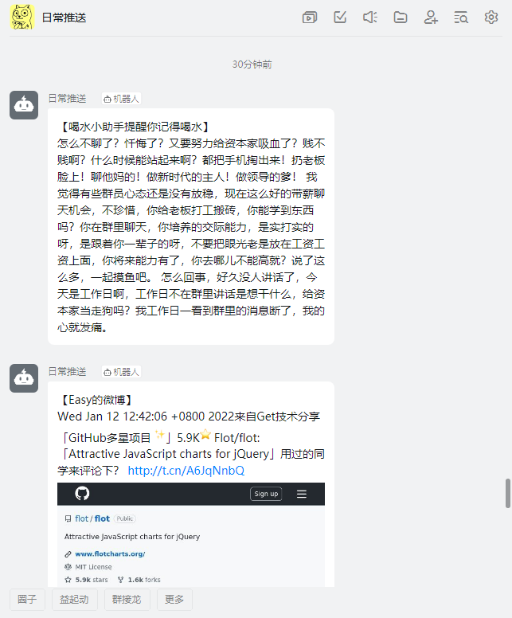

# daily_push

日常推送

- 将每天抓取的微博博主发布的内容、每日天气等消息推送到钉钉~
- 将微博博主发布的内容自动保存为hexo的markdown格式，每日执行`hexo g`命令渲染hexo文件，通过nginx静态资源映射~
- 每天喝水提醒~

## 预览



## 目录结构
```text
│  base.py          基础配置，公共组件
│  fish_job.py      喝水任务
│  weibo_job.py     微博任务
│  weather_job.py   天气任务
│  hexo_job.py      hexo g任务
│  main.py          程序入口
│  README.md        说明
```

## 搭建
```bash
# 下载
git clone https://github.com/AkaneMurakawa/daily_push.git
# 安装依赖
pip install schedule
pip install requests
```

## 配置
见`base.py`

## 运行
```bash
python main.py &
```

## 测试
```bash
python main.py test
```

## nginx on termux[可选]
```text
# 安装
pkg install nginx
# 查看版本
nginx -v
# 查看配置
nginx -t

cd /data/data/com.termux/files/usr/etc/nginx
vim nginx.conf
# 将location下的root路径改为hexo的public目录

# 重启配置
nginx -s reload

# 访问nginx
http://<ip>:8080
```
